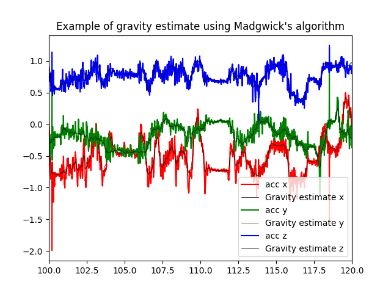

# madgwick_imu
Attitude estimate using Madgwick filter, in Cython. See the [original publication and code](https://x-io.co.uk/open-source-imu-and-ahrs-algorithms/). 

## Installation
From the desired python (>=3.6) environment, clone the repository. From the repository's directory, install the requirements and run the compilation and installation pipelines:
```bash
$ git clone https://github.com/rfayat/madgwick_imu.git
$ cd madgwick_imu
$ pip install -r requirements.txt
$ python setup.py build_ext --inplace
$ pip install .
```


## Usage
### Basic usage
The API is taken from [the implementation available in the ahrs module](https://ahrs.readthedocs.io/en/latest/filters/madgwick.html). Filtering data can be done as follows:
```python
from madgwick import Madgwick
# Create the filter and compute the quaternions
mf =  Madgwick(acc=...,  # array of x, y, z accelerometer values (in G)
               gyr=...,  # array of x, y, z gyroscope values (in radians)
               frequency=...,  # sampling rate (in Herz)
               gain=...)  # filter gain (float)
# Rotate [0, 0, 1] by the resulting quaternions
# Return the estimate of the xyz coordinates of gravity
# in the sensor's reference frame
gravity_estimate = mf.gravity_estimate()
```

### Example script
A data sample and example script is available in the [example folder](example). To run it, install this package as well as pandas and matplotlib and run:
```bash
python -m example.madgwick_imu_example
```
The script generates the following example of gravity estimate from IMU data:

